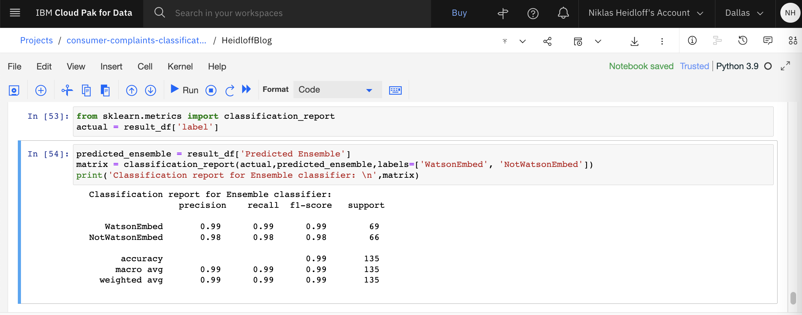

# Text Classification with IBM Watson NLP

Work in progress .....


### Step 1: Prepare Data

The original data is located in [data/heidloffblog/data/input](data/heidloffblog/data/input). The RSS XML files are converted into one resulting [CSV file](data/heidloffblog/output/all-sentences.csv), for example:

```
document_id,text
page1-elem0,Building custom IBM Watson NLP Images.
page1-elem0,IBM Watson NLP (Natural Language Understanding) and Watson Speech containers can be run locally on-premises or Kubernetes and OpenShift clusters.
page1-elem1,Understanding IBM Watson Containers.
page1-elem1,Via REST and gRCP APIs AI can easily be embedded in applications.
```

Run Watson NLP with Docker locally:

```
$ docker login cp.icr.io --username cp --password <your-entitlement-key>
$ mkdir models
$ docker run -it --rm -e ACCEPT_LICENSE=true -v `pwd`/models:/app/models cp.icr.io/cp/ai/watson-nlp_syntax_izumo_lang_en_stock:1.0.7
$ docker build . -f containers/Dockerfile -t watson-nlp-with-syntax-model:latest
$ docker run --rm -it \
  -e ACCEPT_LICENSE=true \
  -p 8085:8085 \
  -p 8080:8080 \
  watson-nlp-with-syntax-model
```

The creation of the CSV file has been automated:

```
$ cd data-prep-and-predictions
$ npm install
$ node convert.js heidloffblog ../data/heidloffblog/
```

### Step 2: Label Data

The labeling of the data needs to be done by domain experts. You need 200-300 positive and the same amount of negative sentences.

The labeling is done via the open source project from IBM, called [Label Sleuth](https://www.label-sleuth.org/). The tool provides an easy to use user interface which provides suggestions what and how to label next entries. Note that not all sentences need to be labeled, but only the important ones. De-facto this removes noise from the original news documents, for example headers, footers, generic code lines etc.

The labeling is not done on a complete document, but on single sentences of a document. If at least one sentence is positive with a confidence level above 80%, the whole document counts as positive. 

The output of Label Sleuth are two CSV files:

* From Label Sleuth: [Default](label-sleuth/heidloffblog/25_11_2022_basic.csv) 
* From Label Sleuth: [Advanced](label-sleuth/heidloffblog/25_11_2022_advanced.csv) (uses additional data items which have been labeled by the tool, not manually)
* [Renamed Default](label-sleuth/heidloffblog/25_11_2022_basic_renamedTrueFalse.csv)

Label Sleuth returns in the second last column 'true' or 'false'. The notebook in the next step doesn't accept this. So 'true' needs to be renamed to 'WatsonEmbed' and 'false' to 'NotWatsonEmbed'. For now this needs to be done manually.  

Here is the structure of the final CSV file (the renamed version):

```
workspace_id,category_name,document_id,dataset,text,uri,element_metadata,label,label_type
heidloff_net,WatsonEmbed,page6_elem0,heidloff_net,TensorFlow Object Detection is a powerful technology to recognize different objects in images including their positions.,heidloff_net-page6_elem0-1,{},NotWatsonEmbed,Standard
heidloff_net,WatsonEmbed,page1_elem6,heidloff_net,Serving Watson NLP on Kubernetes with KServe ModelMesh.,heidloff_net-page1_elem6-0,{},WatsonEmbed,Standard
```

### Step 3: Train Model

The training can be done via Watson Studio. IBM partners can get a test environment on [TechZone](https://techzone.ibm.com/collection/watson-nlp-text-classification#tab-1).

Choose the runtime template 'DO + NLP Runtime 22.1 on Python 3.9 (4 vCPU and 16 GB RAM)' and upload the [notebook](notebooks/HeidloffBlog.ipynb). Before you run it, create a project token with editior access, delete the first cell in the notebook and add the token to the notebook by clicking on the icon at the top with the three dots.

The 'slightly modified' CSV from the previous step is available on IBM's Box and is downloaded automatically by the notebook.

For the training an ensemble model is used which combines three classification models. It computes the weighted mean of classification predictions using confidence scores. It depends on the syntax model and the GloVe and USE embeddings.

* CNN
* SVM with TF-IDF features
* SVM with USE (Universal Sentence Encoder) features

Here are the results:

<kbd></kbd>

### Step 4: Build Image

The trained model is stored in the Watson Studio project and can be downloaded (1.2 GB). Download ensemble_model.zip to the directory 'models', rename it to 'ensemble_model_heidloff.zip', unzip it and delete it.

Run these commands to build the image. Make sure 1. the syntax model and 2. your ensemble_model_heidloff are in the models directory.

```
$ docker login cp.icr.io --username cp --password <your-entitlement-key>
$ chmod -R 777 models/ensemble_model_heidloff
$ docker build . -f containers/Dockerfile -t watson-nlp-with-classification-model
```

Run the container locally via Docker:

```
$ docker run --name watson-nlp-with-classification-model --rm -it \
  -e ACCEPT_LICENSE=true \
  -p 8085:8085 \
  -p 8080:8080 \
  watson-nlp-with-classification-model
```

### Step 5: Run Predictions

You can run run a prediction via curl:

```
$ curl -X POST "http://localhost:8080/v1/watson.runtime.nlp.v1/NlpService/ClassificationPredict" -H "accept: application/json" -H "grpc-metadata-mm-model-id: ensemble_model_heidloff" -H "content-type: application/json" -d "{ \"rawDocument\": { \"text\": \"The Watson NLP containers also provides a gRCP interface\" }}"
```

Alternatively you can run a Node.js app. Put xml file(s) in 'data/heidloffblog/input/test'. There are some sample files.

```
$ cd data-prep-and-predictions
$ npm install
$ node predict.js heidloffblog ../data/heidloffblog/ watson-embed-containers.xml ensemble_model_heidloff
Article IS about WatsonEmbed since the confidence level of one sentence is above 0.8
The sentence with the highest confidence is:
IBM Watson NLP (Natural Language Understanding) and Watson Speech containers can be run locally, on-premises or Kubernetes and OpenShift clusters.
{ className: 'WatsonEmbed', confidence: 0.9859272 }
$ node predict.js heidloffblog ../data/heidloffblog/ not-watson-embed-studio.xml ensemble_model_heidloff
Article IS NOT about WatsonEmbed since the confidence level of no sentence is above 0.8
The sentence with the highest confidence is:
For example IBM provides Watson Machine Learning [http://heidloff.net/article/watson-machine-learning-sample] to identify the best algorithm.
{ className: 'WatsonEmbed', confidence: 0.6762146 }
```

### Step 6: Deploy to Minikube

The following commands show how to deploy to Minikube, but can easily be adopted to other Kubernetes platforms.

In contrast to above, the custom model is stored in its own image (init container). Make sure only your one model is in your 'models' directory.

```
$ python3 -m venv client-env
$ source client-env/bin/activate
$ pip install watson-embed-model-packager
$ tree models
models
└── ensemble_model_heidloff
    ├── cnn_model
    │   ├── ...
    ├── ...
    ├── ensemble_model
    └── use_svm_model
$ python3 -m watson_embed_model_packager setup --library-version watson_nlp:3.2.0 --local-model-dir models --output-csv ./containers/heidloffblog/heidloffblog.csv
$ brew install minikube 
$ minikube start --cpus 12 --memory 16000 --disk-size 50g
$ eval $(minikube -p minikube docker-env)
$ docker login cp.icr.io --username cp --password <entitlement_key> 
$ docker pull cp.icr.io/cp/ai/watson-nlp-runtime:1.0.18
$ python3 -m watson_embed_model_packager build --config ./containers/heidloffblog/heidloffblog.csv
$ docker tag watson-nlp_ensemble_model_heidloff cp.icr.io/cp/ai/watson-nlp_ensemble_model_heidloff:0.0.1
$ docker images | grep watson-nlp
cp.icr.io/cp/ai/watson-nlp_ensemble_model_heidloff      0.0.1     0caf02a1af52   4 minutes ago   1.3GB
cp.icr.io/cp/ai/watson-nlp-runtime                      1.0.18    d26d41463b0d   5 weeks ago     6.86GB
$ kubectl create namespace watson-demo
$ kubectl config set-context --current --namespace=watson-demo
$ kubectl create secret docker-registry \
--docker-server=cp.icr.io \
--docker-username=cp \
--docker-password=<your IBM Entitlement Key> \
-n watson-demo \
ibm-entitlement-key
$ git clone https://github.com/cloud-native-toolkit/terraform-gitops-watson-nlp
$ cp ./containers/heidloffblog/values.yaml ../terraform-gitops-watson-nlp/chart/watson-nlp/values.yaml
$ cd terraform-gitops-watson-nlp/chart/watson-nlp
$ helm install -f values.yaml watson-embedded .
$ kubectl get pods -n watson-demo --watch
$ kubectl get deployment/watson-embedded-watson-nlp -n watson-demo
$ kubectl get svc/watson-embedded-watson-nlp -n watson-demo
$ kubectl port-forward svc/watson-embedded-watson-nlp 8080
```

After this Watson NLP can be invoked for predictions with your model:

```
$ curl -X POST "http://localhost:8080/v1/watson.runtime.nlp.v1/NlpService/ClassificationPredict" -H "accept: application/json" -H "grpc-metadata-mm-model-id: ensemble_model" -H "content-type: application/json" -d "{ \"rawDocument\": { \"text\": \"The Watson NLP containers also provides a gRCP interface\" }}"
```
